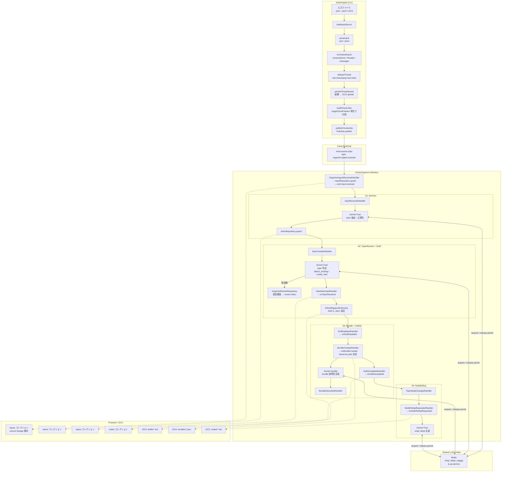
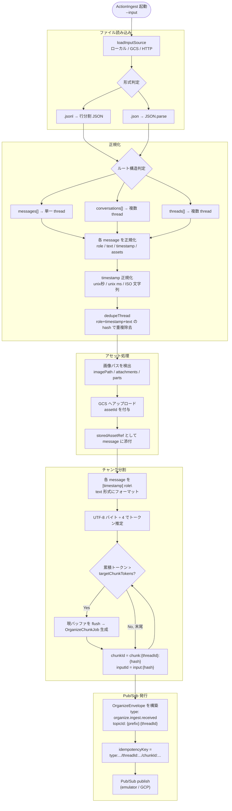
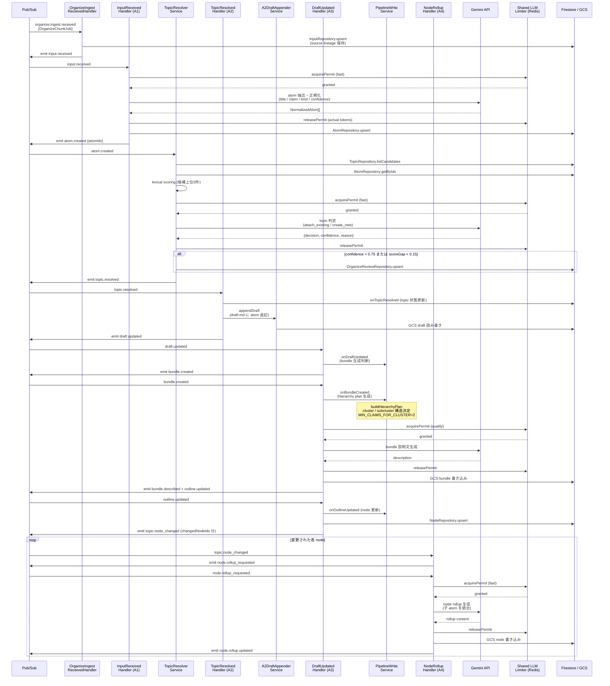
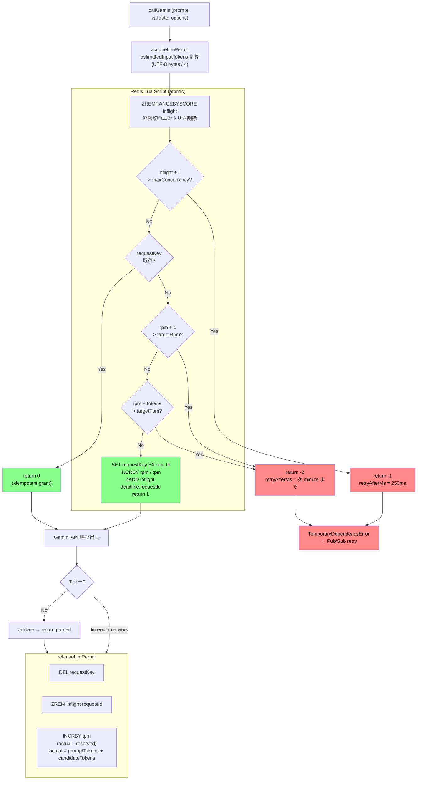
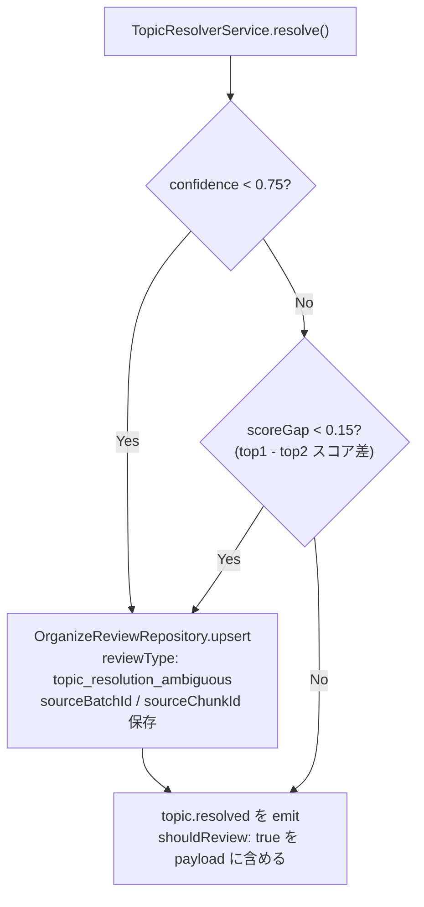
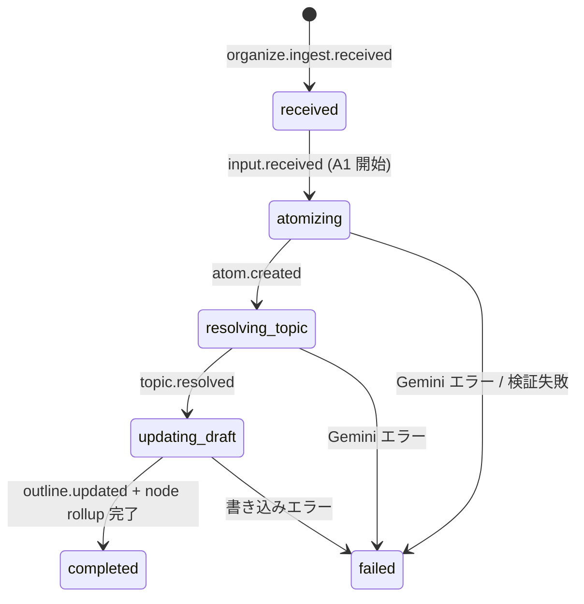

# Ingest / Organize フロー詳細

ActionIngest によるチャット履歴の取り込みから、ActionOrganize による知識グラフ構築までの完全なフローを示す。

---

## 1. 全体構成

---

## 2. ActionIngest 詳細フロー

---

## 3. ActionOrganize パイプライン詳細フロー

---

## 4. LLM Limiter フロー

---

## 5. Review Inbox 振り分け条件

---

## 6. データモデル / 状態遷移

