# Ingest / Organize フロー詳細

ActionIngest によるチャット履歴の取り込みから、ActionOrganize による知識グラフ構築までの完全なフローを示す。

---

## 1. システム全体図

### 1-A. ActionIngest → Pub/Sub

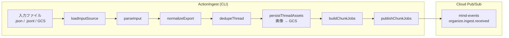

### 1-B. ActionOrganize パイプライン概要

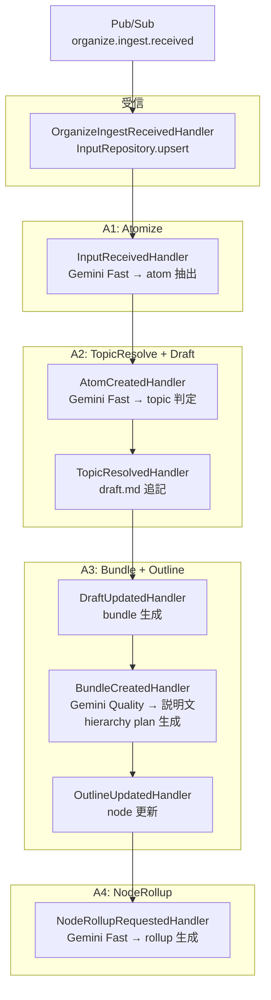

### 1-C. ストレージ書き込み先

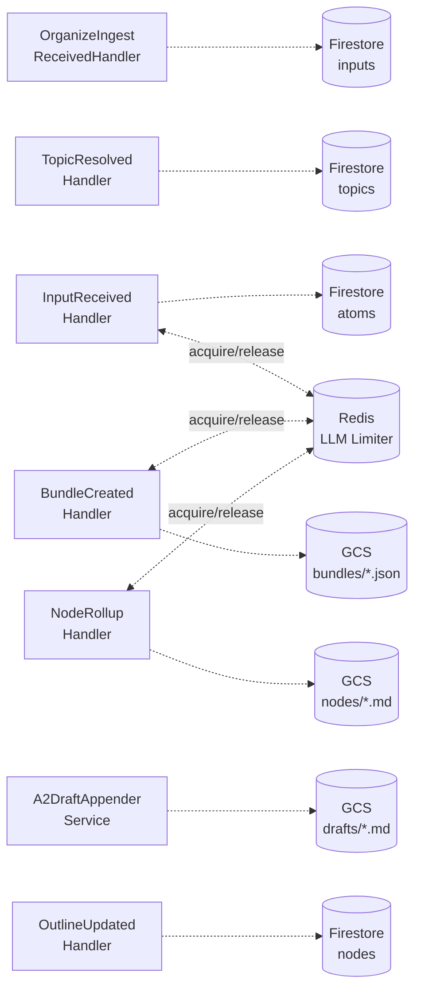

---

## 2. ActionIngest 詳細フロー

### 2-A. ファイル読み込み・正規化

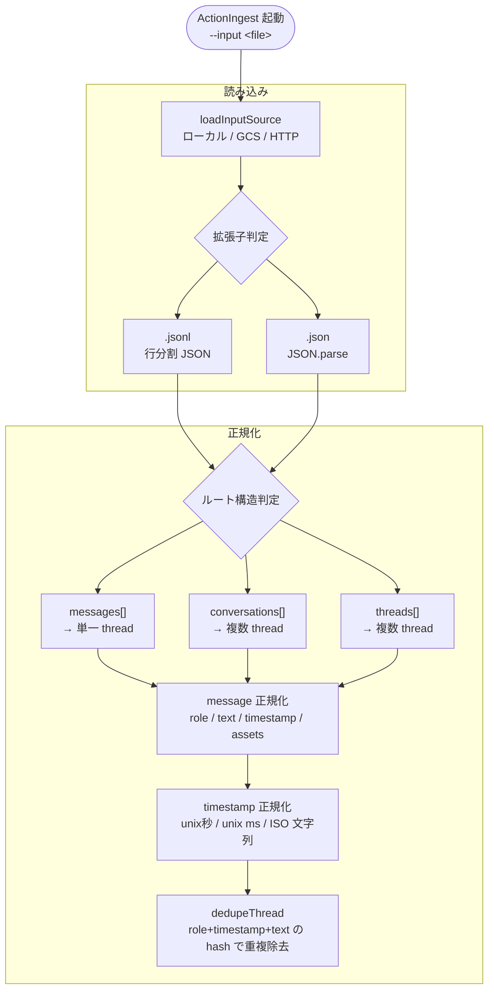

### 2-B. アセット処理・チャンク分割・発行

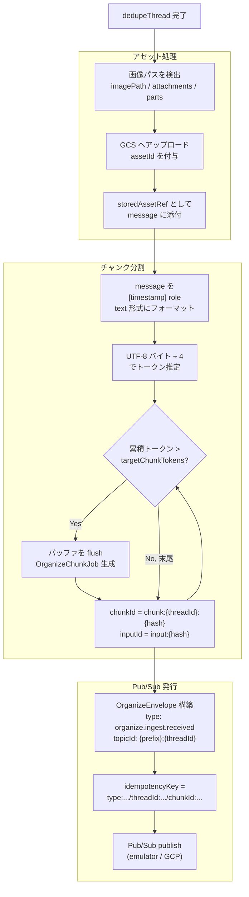

---

## 3. ActionOrganize パイプライン詳細

### 3-A. 受信 → A1 Atomize

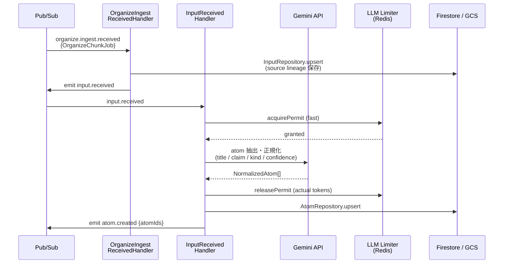

### 3-B. A2 TopicResolve + Draft

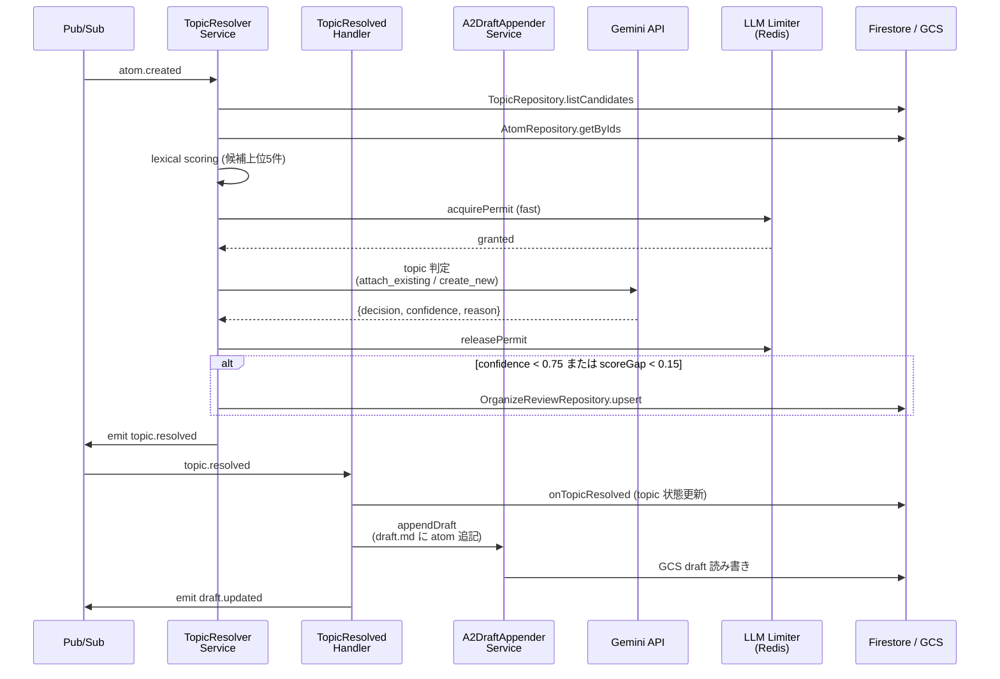

### 3-C. A3 Bundle + Outline

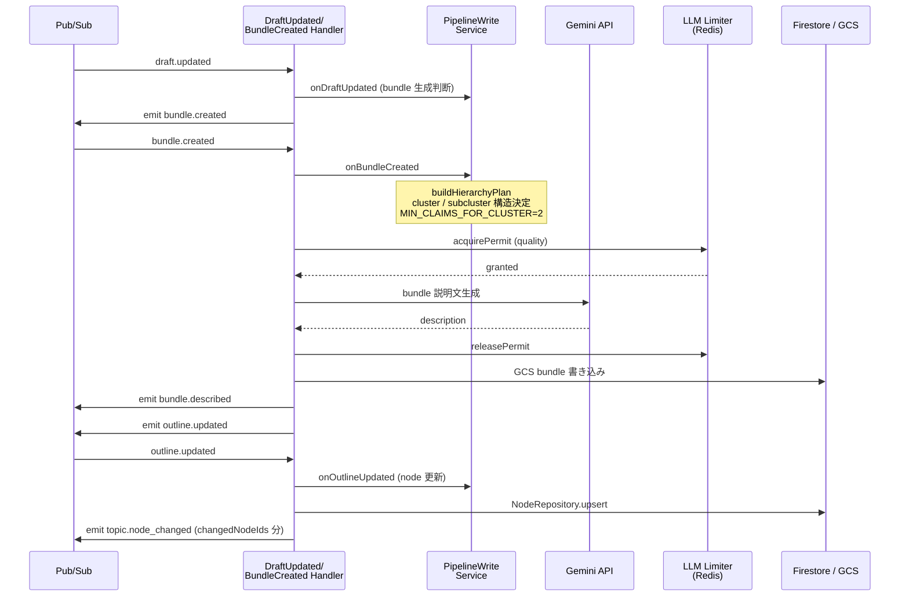

### 3-D. A4 NodeRollup

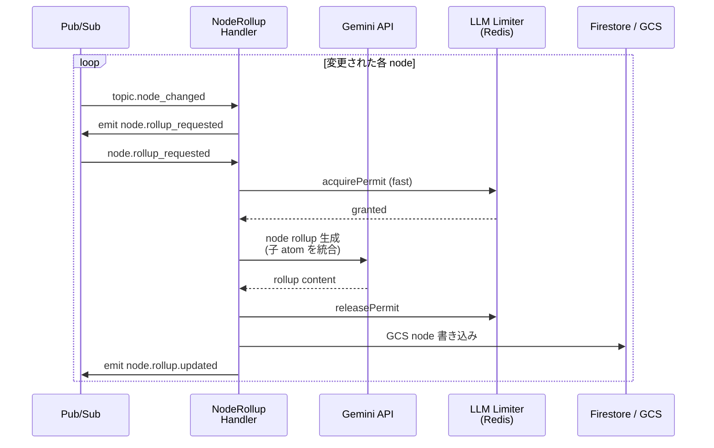

---

## 4. LLM Limiter フロー

### 4-A. permit 取得 (Lua atomic)

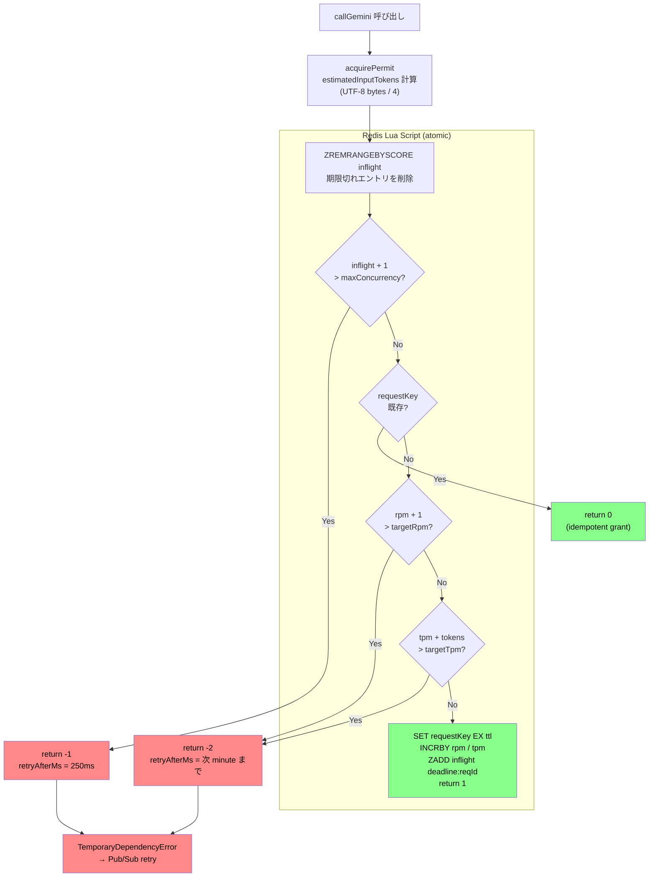

### 4-B. Gemini 呼び出し → permit 解放

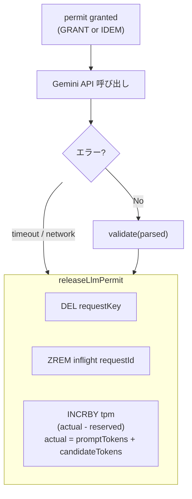

---

## 5. Review Inbox 振り分け条件

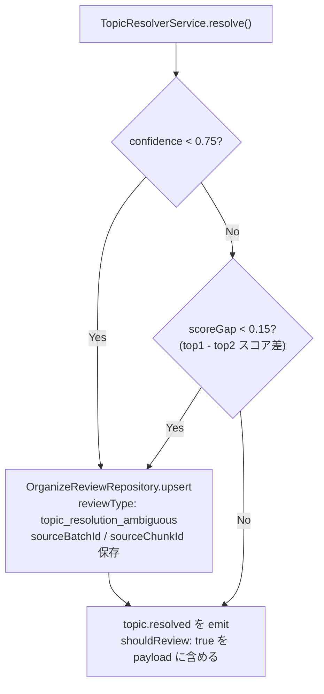

---

## 6. InputProgress 状態遷移

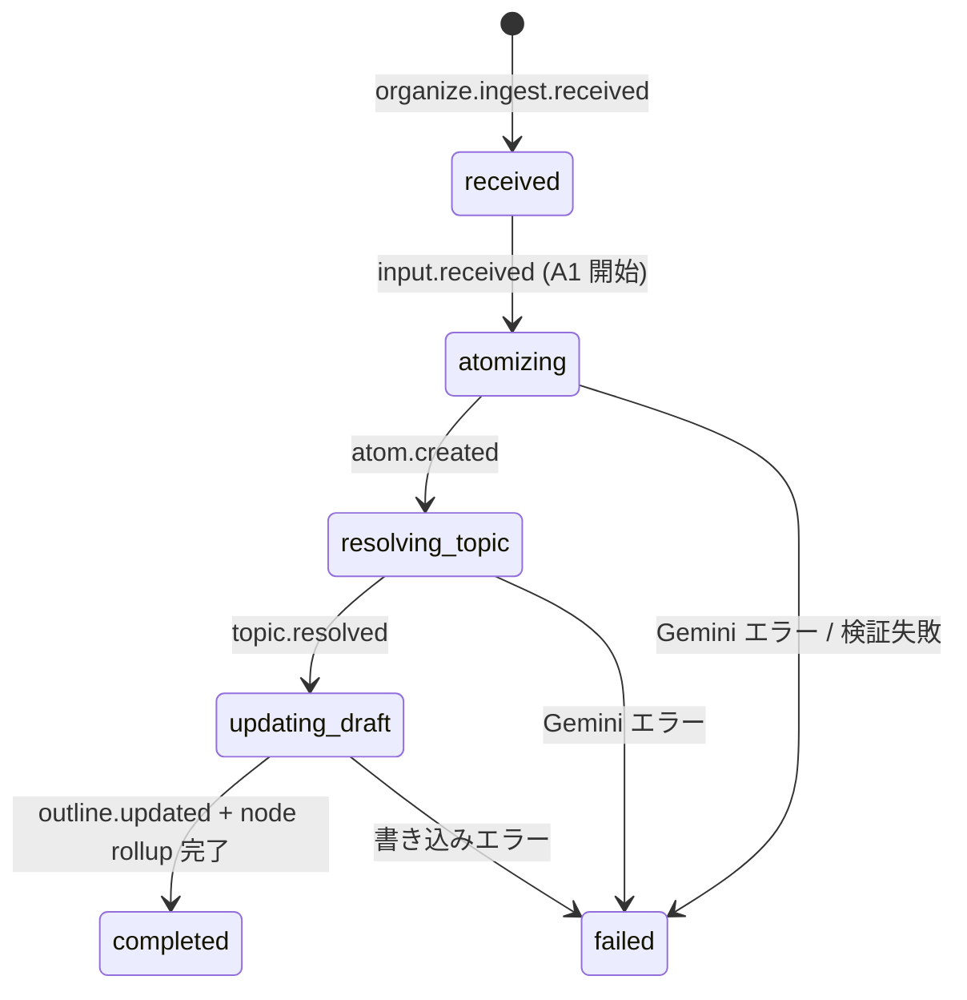
